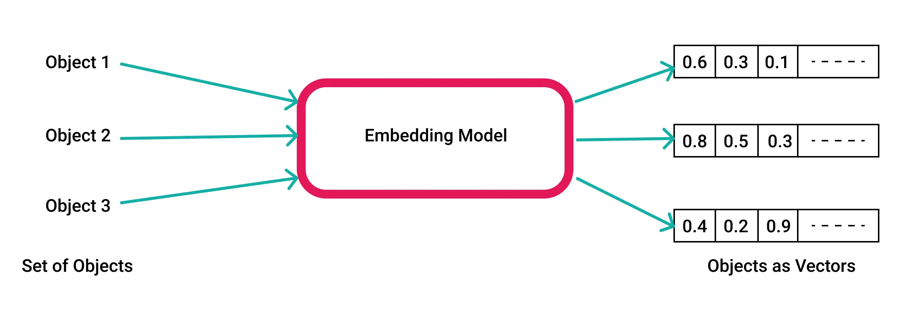
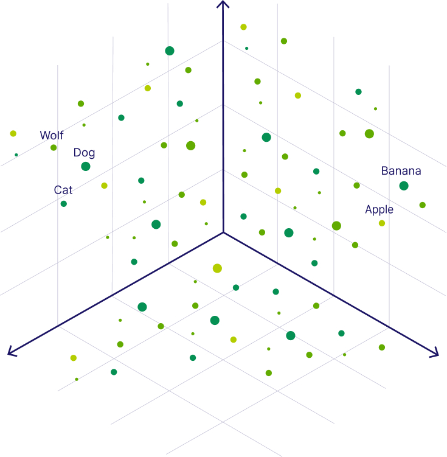
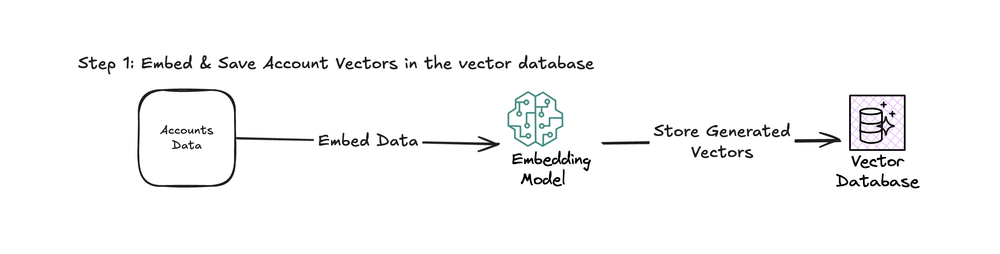
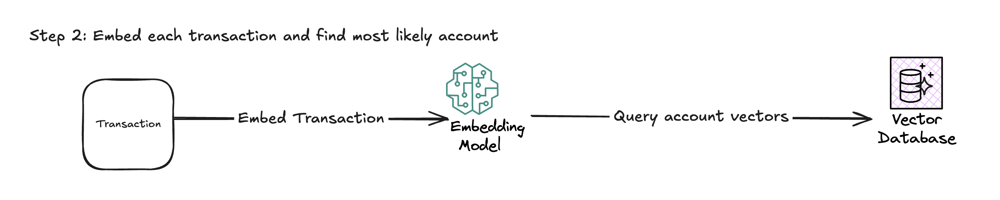
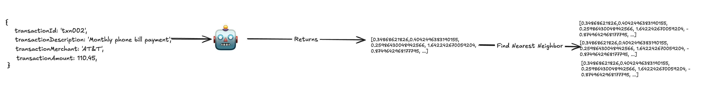

# AI: Vector / Text Embeddings

How text embeddings work and why they are cool 😎

---

# Computers and Humans

- Computers have a hard time understanding anything that isn't some sort of structured data.
- A programming language is constructed to allow a user to bridge the gap between computer and human
  - Some are more computer like: Assembly
  - Some are more English like: Python / Ruby
  - And some are just plain awful: Objective-C

---

# What if there were a better way for computers to understand humans?

- `Vector Embeddings` - Numerical representations of words, sentences, images, etc that captures their **semantic** meaning.
  - AKA: Big list of floats
- ex) 🧑 Human / English: The sky is blue
  🤖 Computer Understanding / Vector Embedding:

```
[0.34868621826,0.4042496383190155,0.25986430048942566,1.642242670059204,-0.8749642968177795, ...]
```

---

# Vector Embeddings

- Vector embeddings are created with a pre-trained embedding model.

  - `nomic-embed-text` - using in demo
  - Open AI: `text-embedding-3-small`
  - Foundational: Word2Vec, BERT, etc.

- This is where the actual AI / Machine Learning is taking place.
  - Trained on a vast amount of data
  - Lots of stats & math and a deep rabbit hole

---

# Vector Embeddings



---

# Vector Embeddings

- Can think of vector embeddings as coordinates in high dimension space.
- The closer that things are in the "high dimension space" the closer that their meaning is
- The number of "dimensions" is the `density`
  - The more dimensions in a embedding modal the more context it has
- https://huggingface.co/spaces/jphwang/colorful_vectors

---

- 

---

# Vector Databases

- `Vector Databases` - Specialized database that can easily store and query embeddings
- `Vector Indexes` - Comes with a vector database. Allows you to quickly search through the vectors to find similar.

- Types of comparisons algorithms
  - Cosine Similarity
  - Dot product
  - Euclidean distance
- No I don't remember what any of these actually mean

---

# Demo

- Goal: Create a transaction categorization service.
  - Based on the transaction description, find the correct account that it be longs to
- Ollama - Used for running open source models locally & for free
- `nomic-embed-text` - popular open source text embedding model
- Qdrant - Open source vector database

---

# Demo

- Accounts will be embedded and then stored in the Qdrant
  - Qdrant Dashboard
    
- Transactions will be embedded and then used to search
- Transactions are not stored in the vector database

---

# Demo



